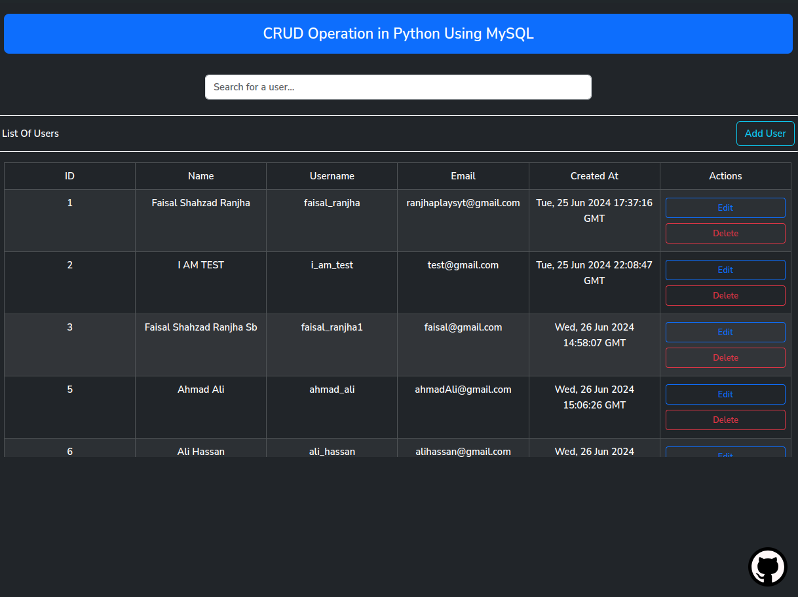
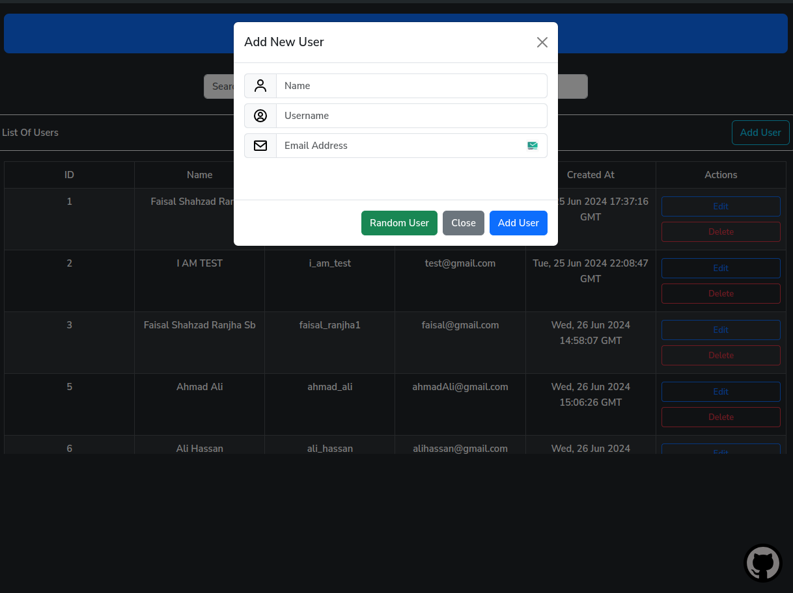
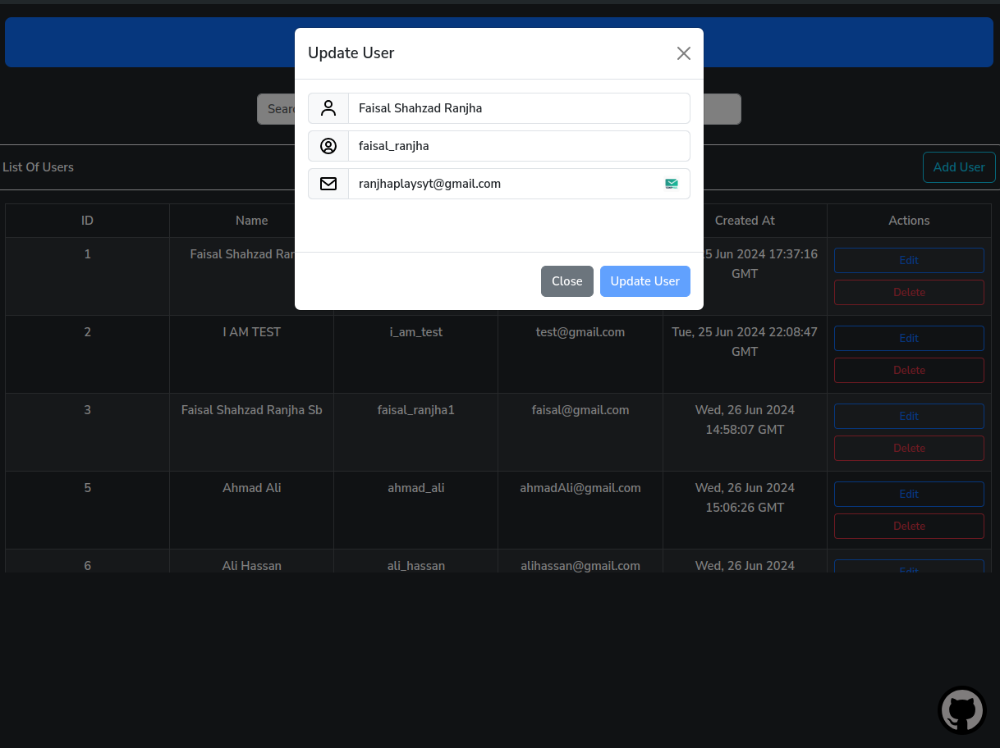
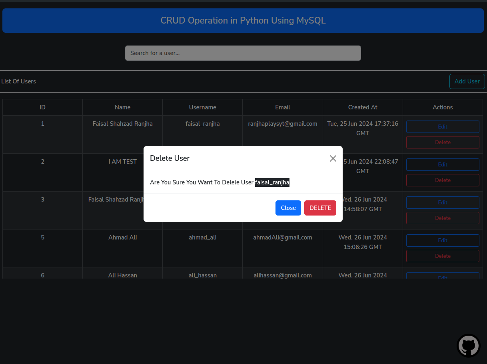

# Flask CRUD Application

A simple CRUD (Create, Read, Update, Delete) application built using Flask, a lightweight WSGI web application framework in Python. This project demonstrates the basic operations of managing user data.

## Table of Contents

- [Introduction](#introduction)
- [Features](#features)
- [Installation](#installation)
- [Usage](#usage)
- [Environment Variables](#environment-variables)
- [Screenshots](#screenshots)
- [Credits](#credits)

## Introduction

This project is a basic web application that allows users to perform CRUD operations on user data. It uses Flask for the backend, a MySQL database for data storage (provided by Aiven), and Bootstrap for the frontend.

## Features

- **Create**: Add new users to the database.
- **Read**: View a list of users.
- **Update**: Edit existing user details.
- **Delete**: Remove users from the database.

## Installation

1. **Clone the repository**:

   ```sh
   git clone https://github.com/FHacKKer/CRUD_IN_PYTHON.git
   cd CRUD_IN_PYTHON
   ```

2. **Create a virtual environment**:

   ```sh
   python3 -m venv venv
   source venv/bin/activate # On Windows use `venv\Scripts\activate`
   ```

3. **Install the dependencies**:

   ```sh
   pip install -r requirements.txt
   ```

4. **Set up the environment variables**:
   Create a `.env` file in the root directory of the project and add the following variables:

   ```env
   DB_HOST=YOUR_DB_HOST_HERE
   DB_USERNAME=YOUR_DB_USERNAME_HERE
   DB_PASSWORD=YOUR_DB_PASSWORD_HERE
   DB_DATABASE=YOUR_DB_DATABASE_HERE
   DB_PORT=YOUR_DB_PORT_HERE # default 3306
   JWT_SECRET_KEY=ANY_RANDOM_SECRET_KEY
   ```

5. **Run the application**:
   ```sh
   flask run --reload --debug
   ```

## Usage

1. **Access the application**: Open your web browser and go to `http://127.0.0.1:5000/`.

2. **Perform CRUD operations**:
   - **Create**: Fill in the form to add a new user.
   - **Read**: View the list of users on the home page.
   - **Update**: Click the edit button next to a user to update their details.
   - **Delete**: Click the delete button next to a user to remove them.

## Environment Variables

Ensure you have the following environment variables set in a `.env` file in the root of your project:

```env
DB_HOST=YOUR_DB_HOST_HERE
DB_USERNAME=YOUR_DB_USERNAME_HERE
DB_PASSWORD=YOUR_DB_PASSWORD_HERE
DB_DATABASE=YOUR_DB_DATABASE_HERE
DB_PORT=YOUR_DB_PORT_HERE # default 3306
JWT_SECRET_KEY=ANY_RANDOM_SECRET_KEY
```

## Screenshots






## Credits

This project was created by [Faisal Shahzad (fhackker)](https://github.com/fhackker).

Special thanks to:

- [Flask](https://flask.palletsprojects.com/)
- [Bootstrap](https://getbootstrap.com/)
- [Aiven](https://aiven.io/)
